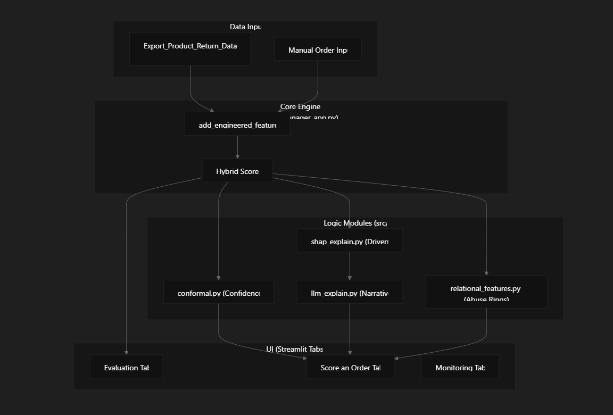
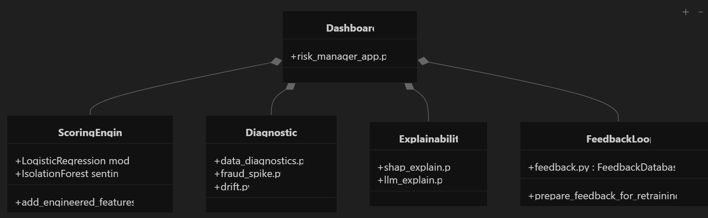

# PreShip AI Risk Manager

A defense-only risk intelligence system for digital commerce operations. This project helps merchants reduce losses from fraud, returns, and chargebacks by scoring orders for review, highlighting risk drivers, and monitoring suspicious volume changes without taking autonomous enforcement actions.

## Track Focus

### AI Risk Manager
Stop the merchant losing money to fraud, returns and chargebacks.

Build a working detector, verifier or auto-responder for one class of loss, with measured precision and recall on a held-out test set.

#### Why now
AI-enabled fraud is hitting Indian BFSI while returns and chargebacks quietly eat margin. This track surfaces the risk and ML-minded builders the others miss.

#### Example directions
- Chargeback evidence responder
- Return-risk scorer
- Fraud-spike detector
- Abuse-ring sentinel

#### The bar
Honest metrics including false-positive cost. Strictly defense-only: anything offense-capable is disqualified.

## What this project does

This repository implements a full operational risk dashboard and supporting modules for:

- return and RTO risk scoring
- hybrid risk modeling using calibrated probability + novelty signal
- SHAP-based order explainability
- confidence estimation and review recommendation logic
- fraud spike monitoring across category, state, and brand segments
- abuse-ring / relational feature modeling for linked-account risk
- chargeback evidence generation for post-dispute workflows
- human feedback collection and retraining support

## Product goals

- reduce false-positive cost through transparent threshold tuning
- help operators focus review on the right orders
- make model decisions explainable and auditable
- keep the system defense-only and human-in-the-loop
- provide a clean demo-ready project structure for GitHub and presentation use

## Project structure

- `risk_manager_app.py` — main Streamlit dashboard entry point
- `src/` — reusable Python modules for scoring, diagnostics, monitoring, and explainability
- `data/` — datasets and CSV inputs
- `models/` — saved model artifacts and metadata
- `archive/` — legacy code retained for traceability
- `requirements.txt` — project dependencies
- `.env` — local environment settings if used

## System Architecture

The application is structured as a modular Streamlit dashboard (`risk_manager_app.py`) that orchestrates specialized logic contained within the `src/` directory.

### High-Level Component Interaction
The following diagram illustrates how the core components interact to process an order and surface risk to the operator.



This flow begins with order data entering the dashboard, where the application validates feature completeness and prepares the record for scoring. The hybrid risk model combines a calibrated probability estimate with a novelty signal to produce a single decision-support score. That score is then passed through explainability, confidence, and monitoring layers so the operator can understand the driver of the risk, the certainty of the recommendation, and whether any related anomaly is emerging in the broader order stream.

### Code Entity Mapping
This diagram bridges the functional requirements to the specific Python classes and functions implemented in the codebase.



The mapping connects the UI layer to the risk-scoring pipeline, the monitoring modules, the relational feature logic, and the feedback loop. The main dashboard orchestrates model training, scoring, and display logic; the source modules handle preprocessing, calibration, feature engineering, SHAP explainability, fraud spike detection, drift diagnostics, and dispute evidence generation. This separation keeps the product modular and makes the system easier to extend as new operational signals or merchant data become available.

## Key features

### 1. Return / RTO risk scoring
- orders are evaluated using customer, product, pricing, and geography signals
- a class-weighted logistic regression model estimates known-pattern risk
- an Isolation Forest novelty component captures unusual numeric profiles
- the hybrid score is blended as:

  hybrid_score = 0.8 × calibrated_probability + 0.2 × novelty_score

### 2. Explainability and verification support
- SHAP feature contributions for top drivers
- fallback coefficient-based explanation when SHAP is unavailable
- plain-English summary generation for operator review
- confidence-aware recommendations instead of raw automation

### 3. Fraud spike detector
- buckets order activity by hourly or daily windows
- groups by logical segments such as category, state, and brand
- computes flagged-order rate compared against historical control limits
- surfaces abnormal spikes using a z-score/control-chart approach

### 4. Abuse-ring sentinel
- builds relational and graph-like signals for shared address, phone, or linked patterns
- estimates ring risk when operational identifiers are available
- designed to complement the main risk score without acting as an autonomous enforcement layer

### 5. Chargeback evidence responder
- assembles a structured evidence packet for disputed orders
- includes risk score, SHAP drivers, prior review history, and supporting context
- produces a bank/payment-processor style response package for dispute handling

### 6. Monitoring and diagnostics
- drift analysis using PSI-style feature comparison
- subgroup parity checks
- dataset diagnostics and label-balance review
- human feedback capture and retraining workflow

## Tech stack

- Python 3.11
- Streamlit
- Pandas
- NumPy
- scikit-learn
- joblib
- SHAP (optional)
- SQLite
- optional local LLM support for explanation generation

## Setup for your own system

### 1. Clone the repository

```bash
git clone https://github.com/<your-username>/<your-repo-name>.git
cd <your-repo-name>
```

### 2. Create a virtual environment

On macOS/Linux:

```bash
python3 -m venv .venv
source .venv/bin/activate
```

On Windows:

```powershell
python -m venv .venv
.\.venv\Scripts\Activate.ps1
```

### 3. Install dependencies

```bash
pip install -r requirements.txt
```

If you are missing any package or want to install the optional explainability stack:

```bash
pip install shap
```

### 4. Run the app

From the project root:

```bash
streamlit run risk_manager_app.py
```

### 5. Optional local LLM setup

If you want the plain-English explanation feature to use a local model, follow your preferred Ollama workflow and configure the app to point to the appropriate local endpoint.

## Environment requirements

- Python 3.10 or newer
- internet access for package installation
- a local dataset in `data/` or your own CSV formatted to match the pipeline
- optional local model runtime if using LLM narrative generation

## Data expectations

The primary demo dataset is `data/Export_Product_Return_Data.csv`.

The project expects fields such as:

- Age
- Gender
- State
- Category
- Brand
- Quantity
- Price
- Discount
- Product Rating
- High_Return_Risk
- Order_Date

For production use, replace the demo data with timestamped merchant data and verify the label definition before live decisions.

## Deployment notes for GitHub

When pushing this project to GitHub:

1. keep the root project clean and professional
2. include a clear `README.md` with setup instructions
3. do not contain sensitive merchant data or customer PII in the repo
4. add a `.gitignore` for local virtual environments and generated files
5. keep only the relevant source files and documentation in the root project

## Operational guardrails

This project is intentionally defense-only.

- it recommends review and verification
- it does not automatically reject an order or customer
- it presents risk as a decision-support signal, not an autonomous action
- metrics and false-positive cost are surfaced clearly so the tradeoff remains transparent

## Performance notes

The included demo dataset is a benchmark dataset and not a production-grade real-world fraud dataset. The app is designed to expose the signal honestly and support iterative improvement with stronger merchant data.

## Summary

This project sits directly in the AI Risk Manager track:

- it minimizes loss from fraud, returns, and chargebacks
- it uses transparent ML and explainability tools
- it is built to be auditable and defense-only
- it provides a realistic and demo-ready operational risk platform that can be extended further with richer merchant data and stronger event histories

